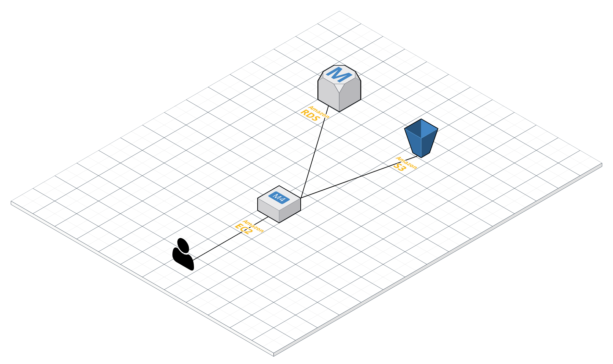

# Smatching API Server

### GitHub Wiki : https://github.com/smatching/Smatching_Server/wiki

* (Android) Google Play Store : https://play.google.com/store/apps/details?id=appjam.sopt.a23rd.smatching

* (iOS) : Upcoming!

## 개발 환경

- JDK8
- Spring Boot 2.1.1 (Embeded Tomcat + Maven)

## 운용 환경

- Application Server : AWS EC2 (Ubuntu)
- Database : AWS RDS (MySQL  5.7)
- File Storage : AWS S3

## 저자

- **유기태** - [ktyu](https://github.com/ktyu)
- Thanks for SOPT 23rd, APP-JAM [Smatching Team](https://github.com/smatching) :D

